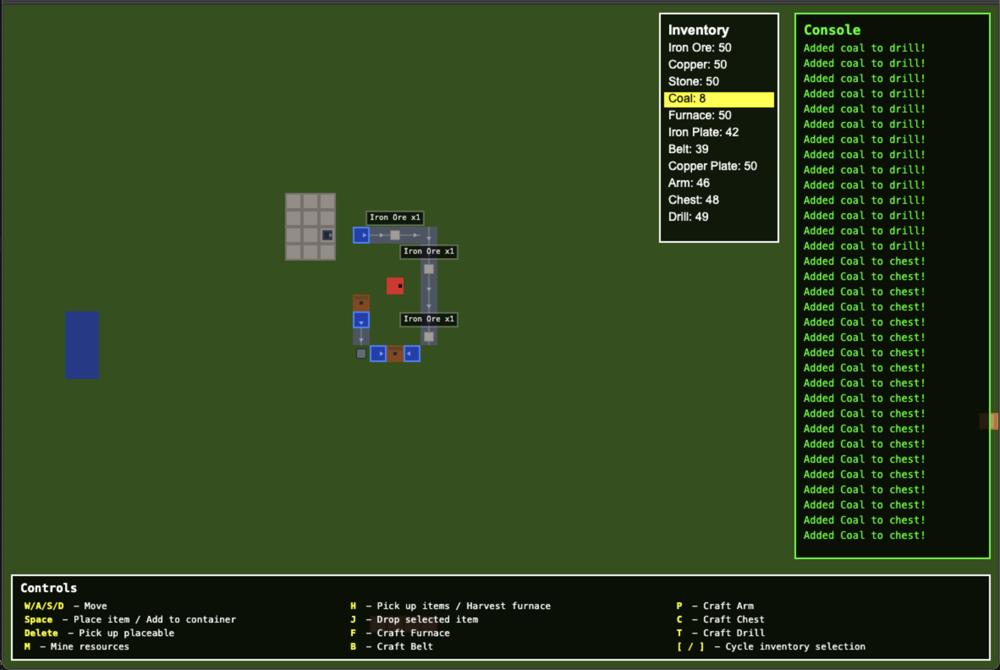

# Factory Building Game



Factory building game. Rust backend compiled to WASM, rendering on browser via vanilla TS, HTML, CSS. Trivially convertible to TUI / headless. Long to-do list of functionality. Hypothetically performant enough to serve as an RL environment. 

Functioning now: 
- Resource mining, drilling, processing
- Basic belt, arm, and storage logic

## Build

```bash
npm run build
```

This compiles Rust to WASM and TypeScript to JavaScript.

## Deploy

Upload to web server:
- `index.html`
- `style.css`
- `fusion-pixel.ttf`
- `.htaccess`
- `dist/` folder
- `assets/` folder

No backend required :)
